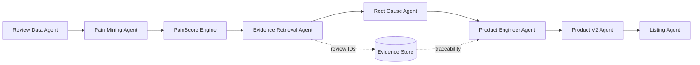
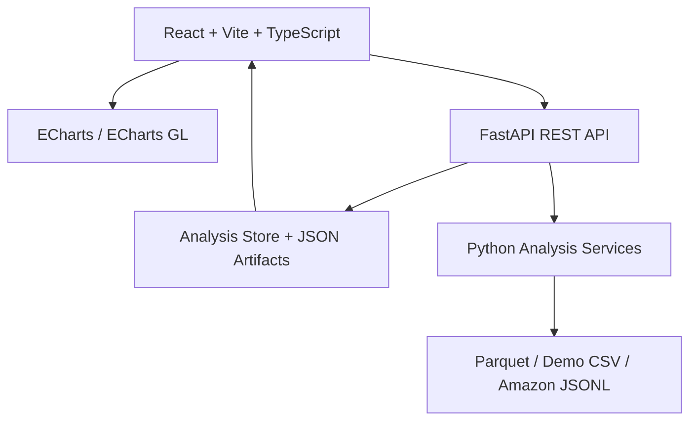

# Review2Product 海报文案与项目逻辑

> **让全球消费者的每一条差评，都成为下一代产品的设计参数。**

## 1. 项目定位

Review2Product 是一个由真实消费者评论驱动的产品进化系统。它不止回答“用户满意吗”，而是进一步回答：

- 用户为什么不满意？
- 哪些问题最值得优先解决？
- 问题背后的根因是什么？
- 下一代产品应该修改哪些参数？
- 每一条建议由哪些真实评论支持？

核心闭环：

```text
REVIEWS → PAIN POINTS → EVIDENCE → ROOT CAUSE → PRODUCT PARAMETERS → PRODUCT V2 → LISTING
```

## 2. 用户痛点

传统评论分析通常停留在情感分类、星级统计或关键词云，无法直接指导研发和商品运营。跨境电商团队面临三个问题：

1. 海量多语言评论难以人工阅读。
2. 负面反馈很多，但无法判断优先级。
3. 分析结论与真实评论脱节，研发、运营和销售难以信任。

## 3. 解决方案

Review2Product 将评论转化为可执行的产品决策：

1. 获取公开 Amazon Reviews 2023 数据。
2. 清洗、去重、标准化并缓存为 Parquet。
3. 筛选 1–3 星负面评论，提取消费者痛点。
4. 通过 TF-IDF + KMeans 聚类，必要时支持轻量 Embedding 降级。
5. 使用可解释 PainScore 排序高优先级问题。
6. 保存 supporting review IDs，提供 Evidence 回溯。
7. 通过规则知识库与可选 LLM 推断 Root Cause。
8. 将根因映射为产品参数改进建议。
9. 生成 Product V2、Selling Points、Listing、FAQ 和主图策略。

## 4. 端到端实现流程

```text
公开数据 / 本地缓存
        ↓
数据获取 Downloader
        ↓
Preprocess：缺失值、去重、文本清洗、语言与评分标准化
        ↓
reviews_clean.parquet
        ↓
负面评论筛选（1–3 星）
        ↓
Pain Mining：TF-IDF / KMeans / 领域词典
        ↓
PainScore：Frequency × Severity × Helpfulness × Recency
        ↓
Evidence Engine：保留 review_id 并检索原文
        ↓
Root Cause Agent：规则优先，LLM 可选
        ↓
Product Engineer Agent：Pain → Parameter
        ↓
Product V2 + Listing Assets
        ↓
FastAPI + React 可视化工作台
```

## 5. 数据与运行结果

当前项目使用完整源码包中的 Amazon Reviews 2023 数据与本地分析快照：

| 指标 | 当前结果 |
|---|---:|
| 商品数量 | 25 |
| 评论总量 | 18,167 |
| 默认 Hero 商品评论 | 1,420 |
| 数据来源 | `amazon_reviews_2023` |
| 分析产物 | 25 个商品分析 JSON + snapshot |
| 商品图片 | 25 张真实商品元数据图片 |
| LLM 模式 | 无 Key 时自动使用 mock / heuristic |

数据获取采用降级策略：

```text
官方公开源 → HuggingFace / 镜像 → 本地缓存 → synthetic_demo
```

Synthetic 数据只用于保证流程可运行，并通过 `data_source` 明确标记，不冒充真实数据。

## 6. PainScore 设计

```text
PainScore = Frequency × Severity × Helpfulness × Recency
```

- **Frequency**：该痛点评论数 / 全部负面评论数。
- **Severity**：基于平均星级，评分越低严重程度越高。
- **Helpfulness**：评论 helpful vote 归一化。
- **Recency**：评论时间归一化，近期反馈权重更高。
- 最终跨痛点归一化到 0–100。

PainScore 由确定性算法计算，禁止由 LLM 随机生成，因此可解释、可复现、可测试。

## 7. Evidence Grounding 证据闭环

每个 Pain Point 保存：

```json
{
  "pain_point": "Functional Failure",
  "pain_score": 92,
  "evidence_review_ids": ["B07C533XCW-101", "B07C533XCW-244"],
  "evidence_status": "sufficient_evidence"
}
```

每个 Product V2 参数保存：

```json
{
  "parameter": "dispensing reliability",
  "current_state": "current design",
  "recommended_state": "engineering validation required",
  "reason": "derived from the linked pain cluster",
  "evidence_ids": ["..."],
  "confidence": 0.88
}
```

前端可沿着以下路径回溯：

```text
Pain Point → Supporting Reviews → Root Cause → Product Fix → Launch Message
```

没有足够证据时，系统标记 `insufficient_evidence`，不强行生成确定性结论。

## 8. Agent 架构



LLM 只负责结构化语言生成与原因润色；核心评分、证据绑定和产品参数映射由确定性代码与知识库控制。没有 LLM Key 时自动切换 heuristic/mock，系统仍可完整运行。

## 9. 技术架构



主要技术：Python、FastAPI、Pandas、DuckDB/Parquet、scikit-learn、React、TypeScript、Vite、ECharts、ECharts GL、Pydantic。

## 10. 后端 API

```text
GET  /health
GET  /api/products
GET  /api/products/{id}
GET  /api/products/{id}/reviews
GET  /api/products/{id}/timeseries
POST /api/analyze
GET  /api/analysis/{product_id}
GET  /api/pain-points/{product_id}
GET  /api/pain-points/{pain_id}/evidence
GET  /api/product-v2/{product_id}
POST /api/generate-listing
POST /api/translate
```

分析不存在时，后端支持按商品懒加载分析并生成 artifact；启动时也会检查 pipeline，避免单个组件失败导致整站不可用。

## 11. 前端五页体验

### Product MRI — Observe

产品健康总览：评论数、平均评分、Pain Index、Critical Pain、Evidence Coverage、Review Dynamics、Pain Distribution 和 3D Customer Pain Landscape。首页增加 25 个商品矩阵，点击商品即可切换整条分析链路。

### Pain Galaxy — Understand

以 Frequency、Severity、Helpfulness 为三维坐标展示痛点。支持 3D 旋转、缩放、自动旋转、Reset Camera，并提供 2D fallback。点击气泡即可打开证据抽屉。

### Evidence Explorer — Evidence

按痛点查看真实评论，支持关键词搜索、评分过滤、证据数量和 Review Inspector。每条证据显示 rating、时间、helpfulness、商品和原文。

### Product Evolution — Evolve

通过 `Customer Pain → Root Cause → Product Parameter` Sankey 图和参数表，把差评转化为 V2 改进方向。参数展示 current、recommended、reason、confidence、evidence 和验证状态。

### Launch Studio — Launch

生成 Listing 标题、Bullet Points、Selling Points、FAQ、Image Storyboard 和 Marketing Message，使产品分析可以直接进入商品上架与市场传播。

## 12. 视觉与交互设计

- 浅色高级 B2B SaaS 风格：白色卡片、浅灰画布、蓝紫青多彩数据色。
- 可折叠 Sidebar、全局商品切换、localStorage 记忆当前商品。
- Presentation Mode：隐藏非必要导航，扩大图表，适合决赛现场和 PPT 截图。
- 统一 ECharts theme、tooltip、颜色映射和 ResizeObserver 生命周期管理。
- WebGL 不可用时自动降级到 2D，保证 CPU 和普通浏览器可运行。
- Evidence Drawer、Sankey 节点点击、痛点跳转、评分点击进入 Evidence 等交互形成闭环。

## 13. 项目创新点

1. **从情感分析升级为产品参数分析**：直接服务研发与商品决策。
2. **Evidence-first**：每条重要结论都能回到真实评论。
3. **可解释 PainScore**：优先级由频次、严重度、帮助度和时效共同决定。
4. **多 Agent 协作但不依赖 LLM**：规则、知识库和 LLM 分工，CPU 环境可运行。
5. **一条链路覆盖产品全生命周期**：Review → Pain → Evidence → Product V2 → Listing。
6. **25 个商品统一工作台**：不仅分析单个 Demo，也支持商品组合切换和横向比较基础。

## 14. 与普通评论分析的区别

| 普通评论分析 | Review2Product |
|---|---|
| 输出满意/不满意 | 输出为什么不满意、改什么 |
| 关键词云和情绪分数 | PainScore + Root Cause + Product Parameter |
| 结论难以验证 | 每个结论连接 Supporting Reviews |
| 面向报告阅读 | 面向研发、运营、Listing 执行 |
| 依赖单一模型 | 确定性算法 + 规则 Agent + 可选 LLM |

## 15. 海报建议布局

### 顶部：一句话卖点

```text
Turn customer evidence into the next product.
让每一条差评成为下一代产品的设计参数。
```

### 中部左：问题与方案

```text
18,167 Reviews
        ↓
5 Pain Clusters
        ↓
Evidence-backed Root Causes
        ↓
Product V2 Parameters
        ↓
Launch-ready Listing
```

### 中部右：核心视觉

建议放三张截图：

1. Product MRI：25 个商品、真实评论数、Top Pain Points、3D Pain Landscape。
2. Pain Galaxy / Evidence：点击痛点气泡后显示 Supporting Reviews。
3. Product Evolution：Sankey 展示 Pain → Root Cause → Product Parameter。

### 底部：技术与价值

```text
Amazon Reviews 2023 · FastAPI · React · ECharts GL · TF-IDF / KMeans · Evidence Grounding
```

商业价值：缩短 VOC 到研发决策的时间，减少主观判断，提升产品迭代和跨境 Listing 优化效率。

## 16. Demo 演示顺序

```text
0–15s    选择商品，展示 25 个商品统一工作台
15–35s   Product MRI：1,420 条评论、5 个痛点、Pain Index
35–60s   进入 Pain Galaxy，展示频次 × 严重度 × 证据的 3D 关系
60–90s   点击 Functional Failure，打开 Supporting Reviews
90–125s  查看 Root Cause 和 Product V2 参数建议
125–160s 查看 Sankey：Pain → Root Cause → Parameter
160–180s 打开 Launch Studio，展示 Listing、FAQ、Storyboard
```

## 17. 启动方式

```bash
cd review2product
start_demo.bat                    # Windows
./start_demo.sh                   # macOS / Linux
```

手动启动：

```bash
python scripts/run_pipeline.py
python -m uvicorn backend.app.main:app --host 127.0.0.1 --port 8000
cd frontend
npm install
npm run dev
```

前端：`http://localhost:5173`  
API 文档：`http://127.0.0.1:8000/docs`

## 18. 已知限制与未来工作

- 当前数据主要来自公开 Amazon Reviews 2023 子集，品类覆盖仍可继续扩展。
- LLM Key 未配置时使用 heuristic/mock，语言润色能力低于真实模型。
- Product V2 数值参数不会被擅自虚构，工程数值需要后续实验验证。
- 可继续增加商品横向竞品矩阵、自动截图导出、更多语言翻译和实验结果回流。

## 19. 结论

Review2Product 的核心不是“看评论”，而是建立一个可信的决策链：

```text
消费者声音
  → 可计算的痛点优先级
  → 可点击的证据
  → 可解释的根因
  → 可执行的产品参数
  → 可上市的 Product V2
```

**Review2Product：从全球消费者声音，进化下一代产品。**
