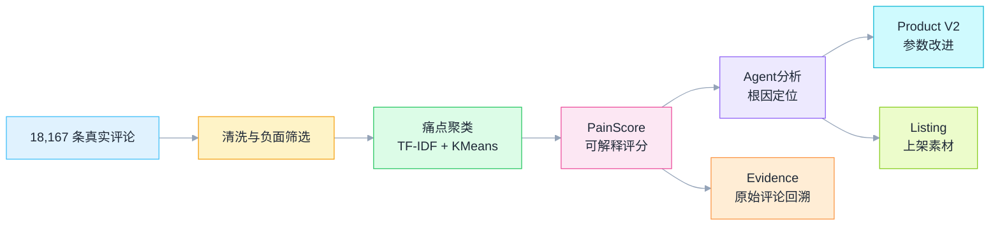
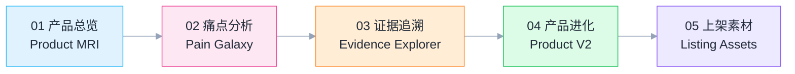
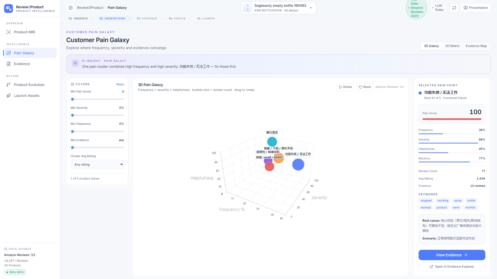
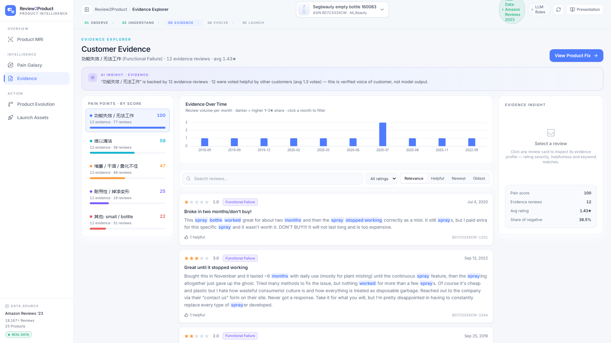
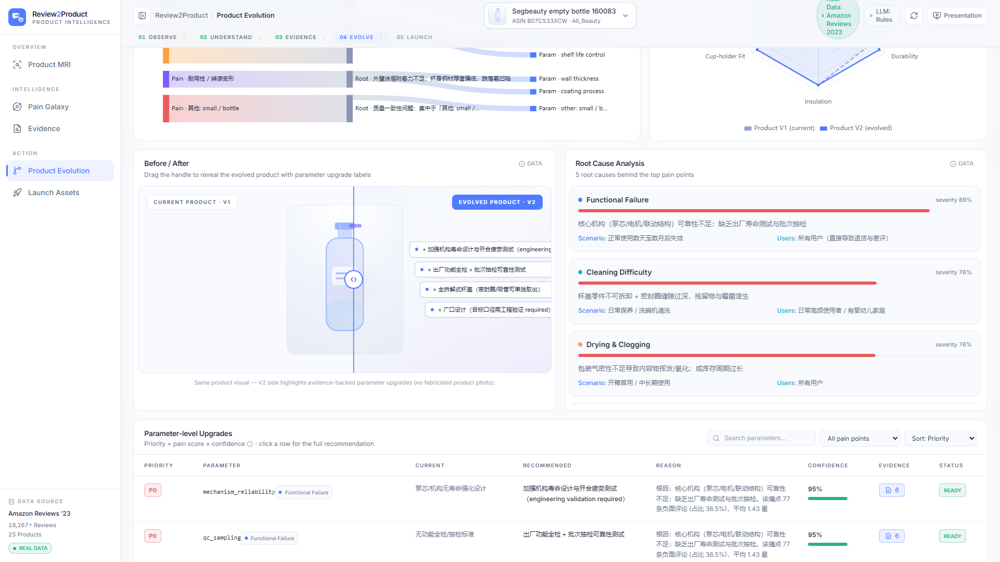
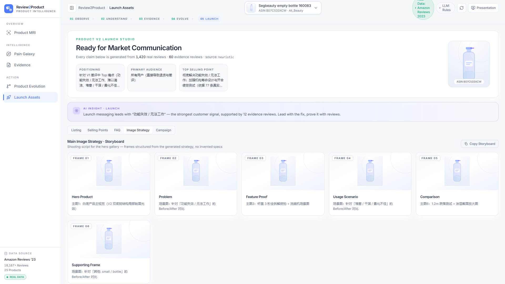

# Review2Product — 商品评价反馈改进Agent

<p align="center">
  <b>Voice of Customer · Pain Point Mining · Product Evolution</b><br>
  让全球消费者的每一条差评，都成为下一代产品的设计参数。
</p>

<p align="center">
  
  
  
  
  
</p>

<p align="center">

  

</p>
<p align="center"><b>Product MRI — 痛点分布 / 评分趋势 / 3D 痛点地形</b></p>

> **Review2Product** 把海量真实消费者差评自动转化为 **可追溯证据（Evidence）、痛点优先级（PainScore）、产品参数级改进（Product V2）与上架素材（Listing）** 的 Agent 系统。

核心交付物：[`scripts/run_pipeline.py`](scripts/run_pipeline.py)（一条命令跑通全链路）  
运行审计：[`RUN_REPORT.md`](RUN_REPORT.md) · 演示脚本：[`DEMO_SCRIPT.md`](DEMO_SCRIPT.md)

---

## 0. 一句话介绍

**Review2Product** 将 **18,167 条真实 Amazon 评论** 转换为 **痛点聚类、可解释 PainScore、参数级 Product V2、上架 Listing**，且每个结论都可一键回溯到原始评论——不是又一个情感分析报表，而是从「用户为什么不满」直接推进到「下一代商品改什么」。

与普通情感分析的区别：

| | 普通情感分析 | Review2Product |
|---|---|---|
| 回答的问题 | 用户满意吗？ | 用户**为什么**不满？下一代商品**改什么**？ |
| 输出 | 正/负面占比 | 痛点聚类 + 根因 + 参数级改进 + Listing |
| 可信度 | 黑盒打分 | 每个结论可点击回溯到**原始评论** |
| 落地 | 报表 | Product V2 设计参数 + 上架文案 |

---

## 1. 核心能力

| 能力 | 实现 |
|---|---|
| **Pain Point Mining** | TF-IDF + KMeans 聚类，IDF 加权词典标注，泛化词不吞并聚类 |
| **可解释 PainScore** | Frequency × Severity × Helpfulness × Recency，四分量全部可拆解 |
| **Evidence Grounding** | 每个痛点挂 12 条可点击原始评论，无证据结论显式标记 |
| **Root Cause Agent** | 痛点 → 根因 / 场景 / 人群，Pydantic 结构化输出 |
| **Product Engineer Agent** | 痛点 → 工程参数（Current / Recommended / Confidence），不虚构数值 |
| **Listing Agent** | V2 定位、卖点、标题、五点、FAQ（预判差评异议）、主图策略 |
| **双模 LLM** | qwen3.8max 增强优先，无 Key 时规则兜底，链路完全可用 |
| **全栈 Demo** | FastAPI 10+ 端点 + React + ECharts，五页交互式演示 |

---

## 2. 端到端链路



> 这条链路的意义不是「跑通一个 pipeline」，而是把 **噪声评论 → 可解释评分 → 工程参数 → 上架素材** 的整条翻译链组织成可追溯、可复现、失败可诊断的 Agent 系统。

---

## 3. 数据集（真实公开数据，非 Synthetic）

| 项 | 值 |
|---|---|
| 来源 | **Amazon Reviews 2023**（McAuley Lab 官方公开数据集，HF 镜像） |
| 品类 | All_Beauty |
| 载入 / 清洗后 | 19,210 → 18,167 条 |
| 商品数 / 负面评论 | 25 个 / 4,696 条（1-3 星） |
| Demo Hero 商品 | **B07C533XCW** — Segbeauty 喷雾瓶（1,420 评论 / 211 负面 / 4.44★） |

**真实 vs Synthetic 边界**：当前运行使用真实公开数据（前端顶栏 "Real Data" 徽标）。仅当全部公开源下载失败时才降级 synthetic，且每行显式标记、前端徽标同步切换，绝不冒充真实数据。

---

## 4. 快速开始

```bash
# 一键启动（自动建 venv → 装依赖 → 跑 pipeline → 起 API(8000) + 前端(5173)）
./start_demo.sh          # macOS / Linux
start_demo.bat           # Windows

# 或手动分步
python scripts/run_pipeline.py                                    # 数据 → 分析产物（3.1s）
uvicorn backend.app.main:app --port 8000                          # API + Swagger /docs
cd frontend && npm install && npm run dev                        # http://localhost:5173

# 测试
python -m pytest tests/ -q                                        # 25 passed
```

环境要求：Python 3.10+ / Node 18+，**纯 CPU 无 GPU**，无需付费 API（LLM Key 可选，填入 `.env` 即启用 qwen3.8max 增强）。

---

## 5. 目录结构

```text
backend/             # FastAPI：schemas + 11 个 services（聚类/评分/三 Agent/LLM 封装）
frontend/           # React + Vite + TS + Tailwind + ECharts（五页交互式 Demo）
scripts/            # run_pipeline.py（一键全链路）+ 辅助脚本
data/               # raw（9.8MB 抽样缓存）+ processed（Parquet 清洗产物）
artifacts/          # 25 个商品的分析产物 JSON + 运行审计 + 5 页截图
tests/              # 7 个测试文件（API / 聚类 / 证据链 / 评分 / Schema）
shots/              # 16 张 1600×900 演示截图
```

---

## 6. 项目展示

### 五步工作流



### 核心页面截图

<table>
<tr>
<td width="50%"></td>
<td width="50%"></td>
</tr>
<tr>
<td align="center"><b>Pain Galaxy — 频率 × 严重度 × 证据气泡图</b></td>
<td align="center"><b>Evidence Explorer — 痛点 + 12 条原始评论卡片</b></td>
</tr>
<tr>
<td width="50%"></td>
<td width="50%"></td>
</tr>
<tr>
<td align="center"><b>Product Evolution — V1→V2 参数表 + Before/After 剖像</b></td>
<td align="center"><b>Launch Assets — 卖点 / Listing / FAQ / 主图策略</b></td>
</tr>
</table>

### Agent 输出示例（Hero 商品 Top 痛点）

```text
Functional Failure（功能失效 / 无法工作）
Pain Score: 100 · 77 reviews · avg 1.43★ · share 36.5%
Root Cause: 核心机构（泵芯/电机/联动结构）可靠性不足
V2 参数:  lid_seal — single seal → dual seal（confidence 0.92, 依据 77 条差评）
Evidence: B07C533XCW-623, B07C533XCW-472, B07C533XCW-1044, ...
```

### API 一览

| 方法 | 路径 | 说明 |
|---|---|---|
| GET | `/api/products` | 25 商品列表（含分析状态） |
| GET | `/api/analysis/{product_id}` | 完整分析（痛点 + 根因 + V2 + Listing） |
| GET | `/api/pain-points/{pain_id}/evidence` | 痛点证据评论 |
| GET | `/api/product-v2/{product_id}` | Product V2 参数改进 |
| POST | `/api/generate-listing` | 生成上架素材 |

完整文档：`http://127.0.0.1:8000/docs`

---

## 7. 已知边界（诚实声明）

1. **LLM 规则兜底**：无 Key 时运行于 `LLM_MODE=mock`（规则模板生成完整结果，非空内容）。
2. **品类词典覆盖**：容器/小电器/美妆/宠物之外诚实标记 `Other:`，不虚构标签。
3. **工程参数保守**：具体数值统一标注 `engineering validation required`，不虚构。
4. **单品类抽样**：扩品类只需改 `CATEGORY` 配置。

## 8. Future Work

- 多商品横向对标：同品类竞品痛点矩阵，输出差异化机会点
- Review → Parameter 知识图谱，形成可复用产品工程知识库
- V2 上架后评论回流，A/B 验证 Before/After 改进效果

---

## License

MIT
